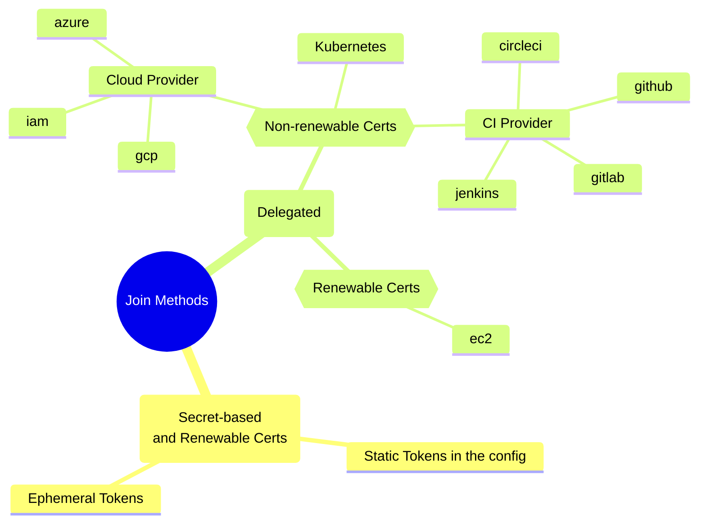

<Admonition type="note" title="Prerequisite">
You must be familiar with the [Teleport Core concepts](../core-concepts.mdx) before reading this page.
</Admonition>

## Definitions

### Joining

Joining a Teleport cluster is the act of establishing trust between a new node and
all the existing nodes, already part of the Teleport cluster. This trust is
established via certificates. Once a node has its certificates, it can interact
with the other Teleport nodes.

To request its certificates, a node must prove its identity to the Auth service.
Teleport offers multiple ways for a joining node to prove its authenticity, they
are called the Join Methods.

### Join Methods

A join method is a way for the Auth server to validate that a node requesting to
join the Teleport cluster is legitimate. Some join methods are universal while
others rely on the joining node context. For example cloud-provider
join-methods (such as `iam`, `gcp` or `azure`) or CI-provider (such as `github`,
`gitlab`, `cicleci`, `jenkins`) are more flexible and provide
better security guarantees but require the joining node to run in a specific
cloud-provider.

Different join methods may provide different security guarantees. e.g. some
join methods allow the joining node to request renewable certificates while other
will require the node to join again to renew its certificate.

The join method and its parameters are specified in the Token.

### Token

A Token is a Teleport resource that specifies which join method can be used in
which context. For example, a token can allow SSH services to join with the
`iam` join method if they are in the AWS account `333333333333` and can assume
the role `teleport-node-role`:

```yaml
kind: token
version: v2
metadata:
  name: my-iam-token
spec:
  roles: [Node]
  join_method: iam
  allow:
  - aws_account: "333333333333"
    aws_arn: "arn:aws:sts::333333333333:assumed-role/teleport-node-role/i-*"
```

<Admonition type="important">
The token name may, or may not be sensitive depending on the join method.
Secret-based join methods rely on the token name to be secret. In such
cases the token name must be protected as knowing the token name in enough
for a node to join the cluster.
</Admonition>

## Classification of join methods



### Static vs Dynamic

A static join method is a method that relies on a long-lived hardcoded token.
Static secret tokens are supported by Teleport for backward compatibility reasons
and their usage is strongly discouraged.

All the other join methods are dynamic: their tokens are created though the API
and can either be long-lived and delegated, or secret and short-lived.
Dynamically-created tokens can sometimes be called Provision Tokens.

### Secret vs Delegated

#### Secret-based join methods

Secret-based join methods are universal. The joining node sends the secret and the
Auth validates that it matches the one it knows. Those joining methods are
inherently prone to secret exfiltration and the Delegated join methods should
be preferred when available. If you have to use a secret-based join method, it is
recommended to use short-lived tokens (valid only 1 hour for example) to reduce
the risk of the token leaking.

Secret-based join methods are:
- static
- ephemeral token

#### Delegated Join methods

Delegated join methods rely on the context of the joining node and a third party to
establish trust. The third party can be a cloud provider, a CI platform or the
container runtime. Those methods cannot be used for every node (e.g. joining an SSH
agent from a Raspberry Pi is not possible) but should be preferred when possible.

Delegated join methods might also offer more granularity. For example, cloud-provider
based join methods can allow nodes to join based on their Availability Zone,
service account, or cloud account ID.

Delegated join methods are:
- iam
- azure
- gcp
- ec2
- github
- circleci
- jenkins
- gitlab
- kubernetes

### Renewable vs non-renewable

Depending on the join method used, the Auth service might issue renewable
or non-renewable certificates.

When the certificate is about to expire, nodes with renewable certificates can
request a new one without having to use a token again. Typically, secret-based join methods
provide renewable certificates because the secret token is sensitive and typically
short-lived. With a single join, the node can stay part of the cluster indefinitely.

Renewable join-methods are:
- ephemeral token
- static token
- ec2

Nodes with non-renewable certificates must join again in order to get a new 
certificate before expiry. The node will have to prove again that it is legitimate.
The non-renewable join methods guarantee that an attacker stealing the node
certificates will not be able to maintain access to the Teleport cluster.
Those join methods can be considered more secure and more apropriate for
temporary workloads such as CI/CD pipelines or containerized environments.

Non-renewable join methods are:
- iam
- azure
- gcp
- github
- circleci
- jenkins
- gitlab
- kubernetes

## Token Resource

### Roles

### Bot

## Join Methods

### Static tokens

<Adminition type="danger">
This join method is inherently less secure because long-lived tokens can be stolen and reused.
Relying on it significantly reduces the security benefits of using Teleport. Its usage is strongly discouraged.
</Adminition>

Static tokens are tokens defined in the Auth service configuration (`teleport.yaml`).
The token name must be kept secret as knowing it allows to join nodes to the Teleport cluster.

```yaml
auth_service:
    enabled: yes
    # Pre-defined tokens for adding new nodes to a cluster. Each token specifies
    # the role a new node will be allowed to assume. The more secure way to
    # add nodes is to use `tctl nodes add --ttl` command to generate auto-expiring
    # tokens.
    #
    # We recommend to use tools like `pwgen` to generate sufficiently random
    # tokens of 32+ byte length.
    tokens:
        - "proxy,node:xxxxx"
        - "auth:yyyy"
        - "discovery,app,db:zzzzz"
```

### Ephemeral tokens

Ephemeral tokens are secret tokens created dynamically via the CLI or Teleport API.
They are time-bound and are typically created just before joining a node to the Teleport cluster.

They can be created by the CLI (a strong random value is picked when not specified, default TTL is 30 minutes):
```shell
$ tctl tokens add --type discovery,app --ttl 15m
```

Or as Teleport resources:

(!docs/pages/includes/provision-token/ephemeral-spec.mdx!)

When a bot uses the 

<Admonition type="note" title="See Also">
- How to [Join Services with a Secure Token](../agents/join-services-to-your-cluster/join-token.mdx).
- [Deploying Machine ID on Linux](../machine-id/deployment/linux.mdx)
</Admonition>


### AWS IAM Role: `iam`

The IAM join method is available to any Teleport process running anywhere with access to IAM credentials,
such as an EC2 instance with an attached IAM role. No specific permissions or IAM policy is required: an
IAM role with no attached policies is sufficient. No IAM credentials are required on the Teleport Auth Service.

Support for joining a cluster with the Proxy Service behind a layer 7 load balancer or reverse proxy is available in Teleport 13.0+.

This is the recommended method to join workload running on AWS.

(!docs/pages/includes/provision-token/iam-spec.mdx!)

<Admonition type="note" title="See Also">
- [Joining Services via AWS IAM Role](../agents/join-services-to-your-cluster/aws-iam.mdx).
- [Deploying Machine ID on AWS](../machine-id/deployment/aws.mdx)
</Admonition>

### AWS EC2 Identity Document: `ec2`

The EC2 join method is available to any Teleport process running on an EC2
instance. Only one Teleport process per EC2 instance may use the EC2 join
method.

IAM credentials with `ec2:DescribeInstances` permissions are required on your
Teleport Auth Service. No IAM credentials are required on the Teleport processes
joining the cluster.

<Notice type="warning">

The EC2 join method is not available in Teleport Enterprise Cloud and Teleport
Team. Teleport Enterprise Cloud and Team customers can use the [IAM join
method](./aws-iam.mdx) or [secret tokens](join-token.mdx).

</Notice>

(!docs/pages/includes/provision-token/ec2-spec.mdx!)

<Admonition type="note" title="See Also">
[Joining Services via AWS EC2 Identity Document](../agents/join-services-to-your-cluster/aws-ec2.mdx).
</Admonition>

### Azure Managed Identity: `azure`

The Azure join method is available in Teleport 12.1+. It is available to any
Teleport process running in an Azure Virtual Machine. Support for joining a
cluster with the Proxy Service behind a layer 7 load balancer or reverse proxy
is available in Teleport 13.0+.

(!docs/pages/includes/provision-token/azure-spec.mdx!)

<Admonition type="note" title="See Also">
- [Joining Services via Azure Managed Identity](../agents/join-services-to-your-cluster/azure.mdx).
- [Deploying Machine ID on Azure](../machine-id/deployment/azure.mdx)
</Admonition>

### GCP Service Account: `gcp`

The GCP join method is available to any Teleport process running on a GCP VM.
The VM must have a
[service account](https://cloud.google.com/compute/docs/access/create-enable-service-accounts-for-instances)
assigned to it (the default service account is fine). No IAM roles are required
on the Teleport process joining the cluster.

(!docs/pages/includes/provision-token/gcp-spec.mdx!)

<Admonition type="note" title="See Also">
- How to [Join Services with GCP](../agents/join-services-to-your-cluster/gcp.mdx).
- [Deploying Machine ID on GCP](../machine-id/deployment/gcp.mdx)
</Admonition>

### GitHub Actions: `github`

### CircleCI: `circleci`

### Gitlab: `gitlab`

### Kubernetes: `kubernetes`

The Kubernetes join methods exists in two variants:
- in-cluster
- JWKS

#### In-cluster

Kubernetes in-cluster joining is available for any Teleport process running
in the same Kubernetes cluster than the Auth service. It uses the Kubernetes
ServiceAccount tokens to validate the pod identity. The method relies on the
[Kubernetes TokenReview API](https://kubernetes.io/docs/reference/kubernetes-api/authentication-resources/token-review-v1/)
which is typically only reachable from within the Kubernetes cluster. Because of
this limitation, this join method is only available for self-hosted Teleport
clusters in Kubernetes.

This method should be preferred when available as tokens are revoked as soon as
the pod exists.

The Kubernetes in-cluster join method is available in self-hosted versions of
Teleport 12+.

(!docs/pages/includes/provision-token/kubernetes-in-cluster-spec.mdx!)

<Admonition type="note" title="See Also">
- [Joining Services via Kubernetes ServiceAccount Token](../agents/join-services-to-your-cluster/kubernetes.mdx)
</Admonition>

#### JWKS

Kubernetes JWKS joining is available for any Teleport process running in
Kubernetes. The Auth service does not have to run in Kubernetes so this method
can be used with any Teleport cluster, including Teleport Cloud.
This join method works by exporting the public Kubernetes signing keys and using
them to validate Kubernetes SA token signatures. The signature validation can be
performed by an Auth without access to the Kubernetes.

The Kubernetes JWKS join method is available in Teleport 14+.

(!docs/pages/includes/provision-token/kubernetes-jwks-spec.mdx!)

<Admonition type="note" title="See Also">
- [Deploying Machine ID on Kubernetes](../machine-id/deployment/kubernetes.mdx)
</Admonition>

<Admonition type="warning">
You will need to update the tokens with new JWKS after rotating the Kubernetes CA.
</Admonition>
